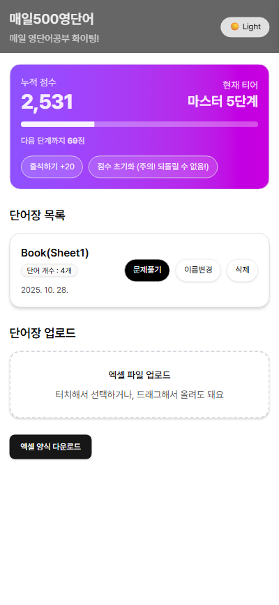
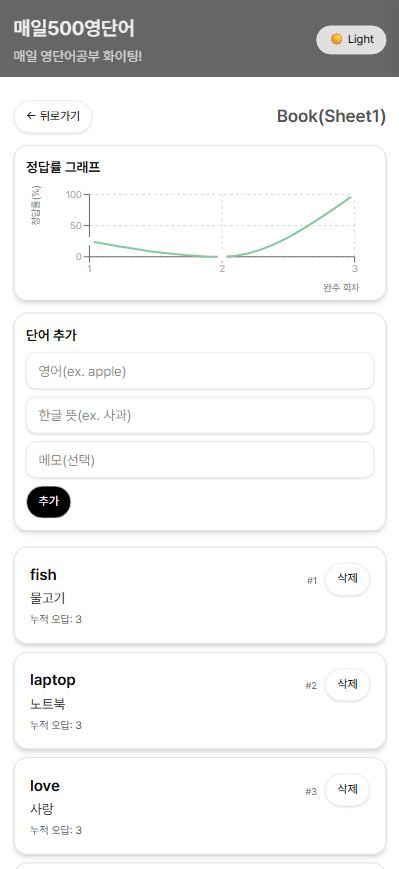
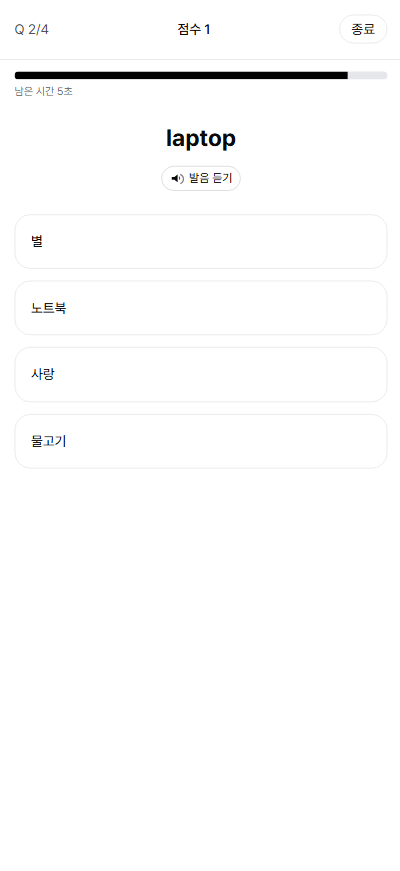
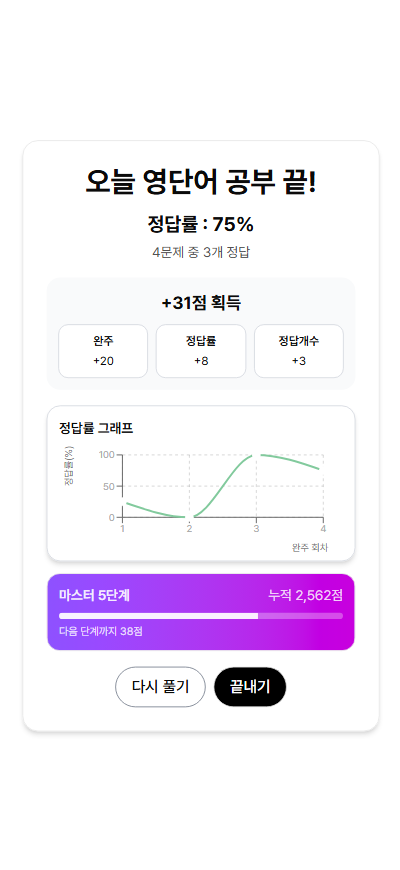

# 매일500 영단어
> **쉬운 단어장 업로드 기능, 매일 학습할 수 있도록 동기부여 시스템을 갖춘 영단어 학습 애플리케이션**  
> 

>> [데모 (Vercel 배포)](https://eng500-everyday.vercel.app/)

---

## 📸 스크린샷

  
  
  
  
  

---

## 🎮 프로젝트 개요
매일500영단어는 
사용자는 기본 단어장 또는 엑셀로 업로드한 개인 단어장을 사용해
매일 문제풀이를 통해 쉽고 재밌게 영단어를 학습할 수 있습니다.

- **쉬운 단어장 업로드 & 기본 단어장 제공**: 앱 내에서 번거롭게 단어장을 작성할 필요 없이, 제공되는 엑셀 템플릿에 단어를 채워 업로드하면 자동으로 영단어장을 생성해줍니다
- **랜덤 선택지 & 음성 제공 문제풀이**: 보기는 매번 새롭게 셔플되어 제공되며, 영어 발음을 들려주어 영단어 학습의 효율을 높여줍니다
- **정답률 통계 & 단어별 누적 오답 횟수**: 문제풀이 정답률 데이터를 저장해 학습 경과에 따른 발전을 시각적으로 확인 가능합니다. 단어별 누적 오답 횟수를 통해 많이 틀린 단어가 무엇인지 파악 가능합니다.

---

## 🛠 기술 스택

### 🎨 Frontend

---

## 👥 기여자

- #### 김승호 – Backend/Frontend 개발, 기획, 디자인
